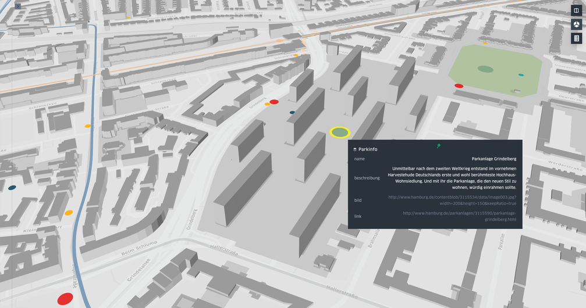

# HAW M-INF Hauptprojekt

*This Jupyter Notebook visualises geospatial data concerning the city of Hamburg, Germany. Maps are generated by [kepler.gl for Jupyter](https://github.com/keplergl/kepler.gl/tree/master/bindings/kepler.gl-jupyter). I built these Notebooks as part of the master programme at the HAW Hamburg during the 2019/20 semester. Documentation is only available in German.*

In diesem Projekt werden mithilfe von [kepler.gl für Jupyter](https://github.com/keplergl/kepler.gl/tree/master/bindings/kepler.gl-jupyter) verschiedene Geodaten zur Stadt Hamburg visualisiert. Der Fokus liegt dabei auf dem Thema "Mobilität". Die generierten Karten entstammen den Notebooks "Hamburg Mobility Map" und "StadtRAD Quartale". Das Notebook "StadtRAD Datenanalyse" dient vor allem der Untersuchung des StadtRAD Datensatzes und zum Ausprobieren von Visualisierungen.

## Ordnerstruktur

### `config`

Hier werden die Konfigurationen der generierten Karten im JSON-Format gespeichert. Diese werden beim erneuten Ausführen der Notebooks wieder geladen, sodass die (teilweise mühsame) Konfiguration der Karten nicht verloren geht.

### `data`

Hier befinden sich die Daten, die zur Analyse und Visualisierung verwendet werden. Dafür wurden die Rohdaten entweder ins GeoJSON-Format konvertiert oder vorher durch ein Notebook unter `data_prep` aufbereitet.

### `data_prep`

Dieser Ordner enthält zwei Notebooks, in denen Daten zum StadtRAD Hamburg aufbereitet werden.

### `generated_maps`

Hier werden die von kepler.gl generierten Karten im HTML-Format gespeichert. Es wird empfohlen, die Karten vornehmlich im HTML-Format aufzurufen, da sie so flüssiger laufen und leichter zu bedienen sind. Bei einigen Browsern könnten Fehler in der Darstellung auftreten.
